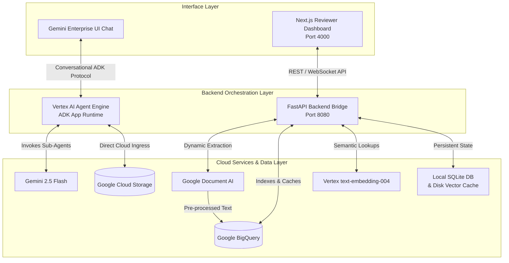

# 🗂️ BioPharma Dossier Harmonizer

[](https://nextjs.org/)
[](https://fastapi.tiangolo.com/)
[](https://www.python.org/)
[](https://deepmind.google/technologies/gemini/)

**BioPharma Dossier Harmonizer** is a state-of-the-art, multi-agent compliance and verification engine designed for pharmaceutical regulatory affairs. It automates the auditing, alignment, and harmonization of electronic Common Technical Document (**eCTD**) packages and Chemistry, Manufacturing, and Controls (**CMC**) dossiers against international guidelines (**ICH, FDA, EMA**).

---

## 🛠️ System Architecture

The platform bridges enterprise chat entry points (Gemini Enterprise UI) with an offline power-user analytical suite:



---

## 👥 Multi-Agent Orchestration Topology

Built using the **Google Agent Development Kit (ADK)**, a sequential coordinator delegates complex compliance audits to expert reasoning nodes:

```text
[PharmaOrchestratorAgent] ➔ Master Sequential Coordinator
  ├── DossierIngestionAgent     ➔ Extracts PDF/XML contents via Document AI
  ├── ParallelRegulatoryAnalysisStage (Parallel Execution)
  │     ├── RegulatoryRetrievalAgent ➔ Local 768-dimensional Vector RAG
  │     ├── DeltaAnalysisAgent       ➔ Multi-version symmetrical diffing
  │     └── LabelHarmonizerAgent     ➔ DailyMed SPL registry alignment
  ├── ComplianceAgent           ➔ Scans folder layouts & schema validation
  ├── EctdShellAgent            ➔ Drafts outline frameworks automatically
  └── FinalReviewerAgent        ➔ Emits Pydantic-validated compliance reports
```

---

## 📂 Repository Layout

```text
pharma-dossier-harmonizer/
├── pharma_agent/         # ADK Agent definitions, tools, schemas, and ground truth
│   ├── agent.py          # Core coordinator agent
│   ├── tools.py          # RAG search, document parsers, database lookup tools
│   ├── schemas.py        # Pydantic schemas for data formatting
│   └── ground_truth/     # Staged source dossiers & regulatory target guides
├── app/                  # FastAPI Backend Server & Streamlit analytics
│   ├── main.py           # Backend api bridge (Port 8080)
│   └── streamlit_app.py  # Streamlit reference dashboard
├── frontend/             # Next.js 14 Web UI Dashboard (Port 4000)
├── cloud_functions/      # GCP dynamic file pipelines (webhook synchronization)
├── scripts/              # Infrastructure and deployment automation
├── requirements.txt      # Python package list
└── README.md             # This document
```

---

## 🚀 Getting Started

Follow these steps to spin up the complete analytical stack locally:

### Prerequisites
- **Python:** Version `3.10` or higher
- **Node.js:** Version `18.x` or higher

---

### Step 1: Spin up the FastAPI Backend

1. **Activate Environment & Install dependencies**:
   ```bash
   python3 -m venv .venv
   source .venv/bin/activate
   pip install -r requirements.txt
   ```
2. **Start the backend server on port `8080`**:
   ```bash
   uvicorn app.main:app --host 0.0.0.0 --port 8080
   ```

---

### Step 2: Spin up the Next.js Frontend Dashboard

1. **Install Node packages**:
   ```bash
   cd frontend
   npm install
   ```
2. **Launch the dev server on port `4000`**:
   ```bash
   npm run dev -- -p 4000
   ```
3. Open your browser and navigate to **`http://localhost:4000`**.

---

## 🔐 API Authorization & Security

All local Next.js client requests are authorized through custom API security keys:
* **Header Key:** `X-API-Key`
* **Default Secret:** `biopharma-secret-key-12345`

---

## 📖 Comprehensive Guides & Documentation

* **HTML Interactive Guide:** Open [scratch/user_guide.html](file:///Users/nitinagga/Documents/pharma-dossier-ge/scratch/user_guide.html) in any browser. This guide is fully formatted for seamless copy-pasting into Google Docs or Microsoft Word without losing styles.
* **Markdown Source:** View the [user_guide.md](file:///Users/nitinagga/Documents/pharma-dossier-ge/user_guide.md) in this workspace.
* **Guide Compiler:** Run `python3 scratch/export_user_guide.py` to compile markdown updates into the styled HTML guide.
