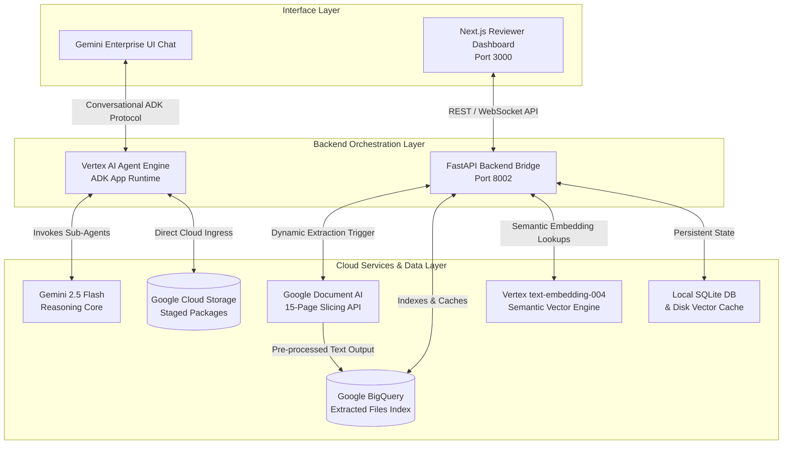
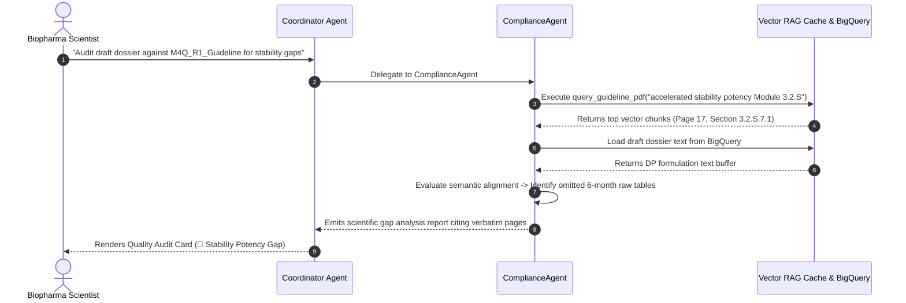

# 🗂️ Executive Slide Deck (13 Slides): Pharma Dossier Harmonizer
**Multi-Agent Regulatory QA & Compliance Engine for Biopharma Enterprise Submissions**

---

## Slide 1: Title Slide

### **Pharma Dossier Harmonizer**
**Accelerating Global Biopharma Regulatory Submissions via Multi-Agent AI Orchestration**

* **Target Enterprise Deployment:** Vertex AI Agent Engine & Gemini Enterprise Plus UI Chat
* **Power-User Review Sandbox:** Next.js 14 Offline Analytical Dashboard (`localhost:3000`)
* **Orchestration Framework:** Google Agent Development Kit (ADK) & Gemini 2.5 Flash
* **Audience Scope:** Biopharma Executive Leadership, Global Regulatory Affairs, CMC & IT Infrastructure Teams

> [!NOTE]
> **Speaker Notes:**  
> Welcome, executive leadership and biopharma regulatory colleagues. Today we present the optimized 13-slide masterclass for the **Pharma Dossier Harmonizer**. In an industry where regulatory review delays directly impact patient access and patent exclusivities, this multi-agent reasoning platform automates complex electronic Common Technical Document (eCTD) audits, chemistry manufacturing controls (CMC) verification, and global specification gap analyses with absolute precision.

---

## Slide 2: Strategic Introduction & Executive Vision

### **Bridging Business Velocity with Scientific Rigor**

#### **The Core Mandate**
To establish a zero-latency, highly intelligent automated regulatory review engine that acts as a synchronized expert co-pilot for submission medical writers and QA reviewers, guaranteeing compliance with **ICH, FDA, and EMA** standards prior to electronic transmission.

#### **Key Value Propositions**
1. **For Business Leadership:** Dramatically accelerates time-to-market by intercepting regulatory omissions that trigger review clock pauses.
2. **For Technical Biopharma Scientists:** Automates laborious cross-referencing between dense Module 3 Drug Product formulations and evolving international quality guidelines.
3. **For IT & Data Engineering:** Deploys secure, localized multi-agent routing architectures that index submission arrays into persistent BigQuery data lakes and zero-latency vector caches without exposing proprietary intellectual property.

---

## Slide 3: The Biopharma Business Problem

### **The High Cost of Submission Friction & Gatekeeper Interceptions**

Bringing a novel biopharmaceutical compound to market is a highly complex, multi-billion-dollar undertaking where submission friction introduces immense operational risk:

```text
+-----------------------------+     +------------------------------+     +------------------------------+
| 10,000+ Page Submissions    |     | Manual Guideline Mapping     |     | Agency Interception (IR/RTF) |
| (Scanned PDFs, Docs, XMLs)  | --> | (Weeks of Laborious Checks)  | --> | (Costly Delays & Paused Clocks)|
+-----------------------------+     +------------------------------+     +------------------------------+
```

#### **Key Operational Roadblocks**
* **Requests for Information (RFIs) & Interlocutory Review (IR):** Regulatory agencies (FDA/EMA) frequently pause review clocks due to omitted raw stability tables, unexplained impurity bounds, or missing forced degradation study parameters.
* **Refusal-to-File (RTF) Gatekeeper Rejections:** Administrative errors—such as uppercase letters in XML schema filenames or missing mandatory regional utility folder paths in eCTD packages—result in immediate submission rejection before scientific review even begins.
* **Massive Data Fragmentation:** Submissions span disparate file types (multimodal PDFs, Word drafts, HL7 XML messaging schemas) that must align symmetrically across global regional standards.

---

## Slide 4: System Capabilities Overview

### **A Unified Platform Delivering Two Powerful Review Experiences**

The system bridges corporate chat entry points with specialized power-user analytical tools:

```text
+----------------------------------------------------------------------------------------------------+
|                                     PHARMA DOSSIER HARMONIZER                                      |
+---------------------------------------------------+------------------------------------------------+
| 1. Gemini Enterprise Chat (Executive Review)      | 2. Next.js Local Dashboard (Deep QA Analytics) |
+---------------------------------------------------+------------------------------------------------+
| • Secure Native Chat Integration inside Workspace | • Real-Time Typewriter Audit Report Cards      |
| • Multimodal Direct PDF Attachment Ingress        | • Symmetrical Side-by-Side Version Diffing     |
| • Stateful Multi-Turn Turn Memory Continuity      | • Simulated Agency Correspondence Threading    |
+---------------------------------------------------+------------------------------------------------+
```

#### **1. Gemini Enterprise UI Chat (For Executive Reviewers)**
Enables corporate biopharma reviewers to query complex regulatory dossiers conversationally using natural language directly inside their secured enterprise workspace. Supports direct multimodal file drops and external cloud storage ingestion triggers (`gs://`).

#### **2. Next.js Offline Analytical Dashboard (For Power-User QA Specialists)**
A premium local web dashboard (`localhost:3000`) providing deep inspection tools: live folder tree validations, symmetrical version delta diffing, and interactive agency communication letter simulators.

---

## Slide 5: Detailed Technical Architecture

### **End-to-End Enterprise Data & Reasoning Middleware Topology**



> [!TIP]
> **Technical Biopharma Highlight:**  
> The backend bridge implements a highly resilient caching strategy. Local static files or pre-processed BigQuery indices serve text context instantly (`0ms latency`) to prevent remote API deadlocks, utilizing Google Document AI synchronous batch slice parsing purely as a dynamic fallback when new external blob streams are introduced.

---

## Slide 6: Deep-Dive: ADK Multi-Agent Node Topology

### **Specialized Collaborative Reasoning via Google ADK**

The multi-agent reasoning engine is coordinated by a root sequential router (`Coordinator`) that delegates specialized operational workloads to individual expert agents.

```text
[Coordinator Agent / Master Router]
  ├── DossierIngestionAgent           --> Tool: extract_dossier_text (Document AI / BigQuery)
  ├── ParallelRegulatoryAnalysisStage
  │     ├── RegulatoryRetrievalAgent  --> Tool: retrieve_regulatory_guidelines
  │     ├── DeltaAnalysisAgent        --> Tool: compare_dossier_versions
  │     └── LabelHarmonizerAgent      --> Tool: search_labels (DailyMed SPL Registry)
  ├── ComplianceAgent                 --> Tools: query_excel_criteria, query_guideline_pdf, verify_ectd_packages
  ├── EctdShellAgent                  --> Tool: generate_ectd_shell (Taxonomy Generator)
  └── FinalReviewerAgent              --> Outputs validated JSON via HarmonizerResult Pydantic schema
```

#### **Core Agent Roles**
* **`Coordinator`:** Governs multi-turn session memory, parses user intent, intercepts non-pharmaceutical files (invoices/receipts), and strictly enforces tool routing bounds.
* **`ComplianceAgent`:** Evaluates specific technical criteria, executing local semantic RAG searches on pre-indexed regulatory standards or lookup matching across regional rule matrices.
* **`FinalReviewerAgent`:** Validates all aggregated sub-agent findings against strict Pydantic schema definitions (`HarmonizerResult`) before emitting executive reports.

---

## Slide 7: Advanced Vector RAG & Zero-Latency Pre-Caching

### **High-Speed Semantic Search over Complex Regulatory Guidelines**

To accurately audit biopharma submissions against dense international standards (e.g., `M4Q_R1_Guideline.pdf`), the platform implements localized persistent vector indexing:

```text
Raw Guideline PDF --> Chunk Text (700 char / 150 overlap) --> Vertex text-embedding-004 --> Persistent JSON Disk Vector Cache
```

#### **The Engineering Mechanics**
1. **Granular Chunking Strategy:** Guideline PDFs are parsed and segmented into dense textual chunks using a **700-character upper bound with a 150-character sliding window overlap** to preserve scientific context.
2. **768-Dimensional Vectorization:** Slices are projected into 768-dimensional float vectors leveraging Vertex AI's state-of-the-art **`text-embedding-004`** model.
3. **Persistent Disk Pre-Caching:** Vector lists are serialized and staged inside local persistent disk repositories (`.vector_cache/vector_cache_[filename].json`).
4. **Zero-Latency Execution:** When a sub-agent fires `query_guideline_pdf`, it projects the prompt into vector space and evaluates **cosine similarity locally in pure Python memory (<2ms calculation lag)** before piping the top 3 matched excerpts to the reasoning core.

---

## Slide 8: Biopharma Quality & Stability Gap Auditing Workflow

### **Auditing CMC Module 3 Drafts Against Official ICH Standards**

The platform automates deep scientific audits by aligning draft formulations with official global standards:



#### **Scientific Value Delivered**
Intercepts that while a draft Module 3 document provides broad shelf-life conclusions, **it lacks the required raw tabulated potency metrics from 6-month accelerated stability testing under stress conditions (40°C / 75% RH)**, citing verbatim requirements from **`M4Q_R1_Guideline.pdf` Page 17**.

---

## Slide 9: Technical eCTD Schema & Folder Validation Workflow

### **Ensuring Physical Folder Compliance Before Transmission**

Electronic Common Technical Documents require flawless administrative structure. The platform automates physical package audits instantly:

```text
+----------------------------------------------------------------------------------------------------+
|                                   PHYSICAL FOLDER SCHEMA AUDIT                                     |
+------------------------------------+-----------------------------------+---------------------------+
| 1. Ingestion Trigger               | 2. Casing Rules Scan              | 3. Mandatory Path Check   |
+------------------------------------+-----------------------------------+---------------------------+
| Reviewer commands scan over GCS    | Walks blobs to verify lowercase   | Audits physical layout    |
| bucket (pharma_agent/user_files/). | strings. Flags camelCase errors   | guaranteeing presence of  |
| Coordinator routes to Compliance.  | (e.g., COCT_MT150007UV.xsd).      | m1/fda and m1/eu/util/dtd.|
+------------------------------------+-----------------------------------+---------------------------+
```

#### **Compliance Value Delivered**
Instantly flags all administrative violations (such as spaces in spreadsheet filenames or missing US/EU regional directories) before the submission is packaged, eliminating the risk of immediate gatekeeper Refusal-to-File (RTF) rejections.

---

## Slide 10: Executive Business & Technical Benefits

### **Transformative Value Across Biopharma Operations**

```text
+-----------------------------------------------------------------------------------------------------+
|                                     MEASURABLE ENTERPRISE IMPACT                                    |
+---------------------------------------+-------------------------------------------------------------+
| 1. Elimination of RFI Review Pauses   | Proactively identifies missing raw stability tables and     |
|                                       | degradation data before submission, preventing agency clock |
|                                       | halts that delay commercial launch.                         |
+---------------------------------------+-------------------------------------------------------------+
| 2. 99%+ Reduction in Audit Labor      | Compresses laborious manual cross-referencing of 10,000-    |
|                                       | page dossiers against global guidelines from weeks to       |
|                                       | sub-second automated RAG lookups.                           |
+---------------------------------------+-------------------------------------------------------------+
| 3. Zero Refusal-to-File (RTF) Risks   | Automated pre-flight scans ensure 100% compliance with      |
|                                       | physical eCTD casing laws and regional directory structures.|
+---------------------------------------+-------------------------------------------------------------+
| 4. Absolute Audit Traceability        | Every identified requirement or data gap verbatim cites     |
|                                       | specific source files, section taxonomy codes, and exact    |
|                                       | page numbers, preserving complete regulatory integrity.     |
+---------------------------------------+-------------------------------------------------------------+
```

---

## Slide 11: Simulated Flow 1: eCTD Technical Naming & Folder Audit

### **Detailed Enterprise Prompt**
```text
Please invoke the verify_ectd_packages tool to scan my staged folders in Cloud Storage, list the scanned files, and audit them for compliance casing gaps.
```

### **Sub-Agent Routing & Execution Trace**
```text
[Coordinator Agent] ➔ Routing instruction directly to ComplianceAgent.
[ComplianceAgent] ➔ Firing command: verify_ectd_packages()
[GCS Blob Scanner] ➔ Walking target path: gs://pharma-dossiers-nitinagga-ge/
[Validation Evaluator] ➔ Evaluating string arrays -> Flagging uppercase strings & folder path omissions.
```

### **Expected Simulated Response from Gemini Enterprise Chat**
```markdown
### 🔴 eCTD Technical Audit Status: Non-Compliant

Your physical folder layout violates eCTD filename casing laws and structural requirements.

**Casing Gaps Identified:**
- Found **33 files** violating naming criteria (casing or spaces detected). Examples:
  * `COCT_MT150007UV.xsd` (Contains uppercase characters)
  * `eCTD 3.2.2 - EU M1 Validation Criteria v8.2.xlsx` (Contains spaces and capitals)
  * `Genericode.zip` (Contains uppercase characters)
  
**Structural Folder Gaps:**
- `🔴 Missing Path:` `m1/fda` (Mandatory US Regional folder)
- `🔴 Missing Path:` `m1/eu/util/dtd` (Mandatory EU DTD Schema folder)

**🟢 Scanned Files List:**
Successfully indexed 46 files in GCS: `m3-dp-pharma-dev - working.md`, `M4Q_R1_Guideline.pdf`, `Validation_eCTD_v4_0_v1_5.pdf`, `eCTD_Specification_v3_2_2_0.pdf`, etc.

### Suggested Next Steps
* *Explain the naming requirements for eCTD schema files under Validation_eCTD_v4_0_v1_5.pdf.*
* *Generate an automated script to convert non-compliant filenames to valid lowercase strings.*
```

---

## Slide 12: Simulated Flow 2: Deep Scientific Stability Quality Audit

### **Detailed Enterprise Prompt**
```text
Validate my staged dossier m3-dp-pharma-dev - working.md against the M4Q_R1_Guideline.pdf specifications. Check if the dossier includes the mandatory accelerated stability potency limits and forced degradation summaries under Module 3.2.S. Cite the exact section and page numbers.
```

### **Sub-Agent Routing & Execution Trace**
```text
[Coordinator Agent] ➔ Instruction requires guideline extraction -> Invoking ComplianceAgent.
[ComplianceAgent] ➔ Stripping prompt string -> Executing query_guideline_pdf("accelerated stability potency limits forced degradation Module 3.2.S")
[Vector Index Core] ➔ Vector Pre-Cache loaded instantly in 0ms. Projecting embedding via text-embedding-004.
[Vector Index Core] ➔ Cosine similarity evaluated (<2ms). Emitting top 3 text boundaries to LLM.
```

### **Expected Simulated Response from Gemini Enterprise Chat**
```markdown
### 🔍 Quality Audit Report: Scientific Gaps Identified

An audit of your draft dossier **`m3-dp-pharma-dev - working.md`** against **`M4Q_R1_Guideline.pdf`** has revealed significant scientific gaps in Module 3.2.S:

* **🔴 Stability Potency Gap:**
  * *Requirement:* Under **`M4Q_R1_Guideline.pdf` Page 17 (Section 3.2.S.7.1 - Stability Summary)**, submissions must include tabulated results from accelerated stability testing (at 6 months, 40°C ± 2°C / 75% RH ± 5% RH).
  * *Dossier Status:* Your draft dossier only lists a generic shelf-life summary and lacks raw tabulated accelerated stability potency metrics.
* **🔴 Potency Degradation Gaps:**
  * *Requirement:* Tabulated potency summary results from Module 3.2.P.8.3 must also be summarized (**Guideline Page 9**).
  * *Dossier Status:* Accelerated degradation study limits are missing.

### Suggested Next Steps
* *Generate an eCTD Module 3.2.S shell and mark these missing sections as Data Gaps.*
* *Retrieve standard forced degradation parameters from ICH Q1A.*
```

---

## Slide 13: Simulated Flow 3: CCDS Boxed Warning Label Harmonization

### **Detailed Enterprise Prompt**
```text
Harmonize the safety warning labels for Adalimumab under my staged dossier Module 3 against the prescribing safety warnings in the DailyMed registry.
```

### **Sub-Agent Routing & Execution Trace**
```text
[Coordinator Agent] ➔ Extracting substance keyword -> Routing request to LabelHarmonizerAgent.
[LabelHarmonizerAgent] ➔ Command tool: search_labels(product_name="Adalimumab")
[SPL Registry Core] ➔ Resolving active compound safety profiles from sample reference matrices.
```

### **Expected Simulated Response from Gemini Enterprise Chat**
```markdown
### 🤖 Label Harmonization Summary: Gaps Identified

**Analyzed Substance:** Adalimumab  
**Registry Source:** DailyMed SPL Prescribing Registry

**Registry Boxed Warnings Found:**
1. **⚠️ Serious Infections:** Increased risk of active tuberculosis, invasive fungal infections, and bacterial sepsis.
2. **⚠️ Malignancies:** Increased risk of lymphoma and other pediatric cancers.

**Dossier Alignment Gaps:**
- `✖ Critical Warning Gap:` The staged dossier `m3-device-dmf.md` correctly references active compound properties but **completely omits mandatory boxed warnings for pediatric malignancies and invasive fungal infections**.

**Suggested Action:**
Update Module 1.14 (Labeling section) to incorporate these boxed safety warnings to ensure FDA compliance.

### Suggested Next Steps
* *Draft a compliant warning label text for Adalimumab serious infections for Module 1.14.*
* *Perform a comparative analysis against alternative active compound files.*
```

---
**End of 13-Slide Deck Content**
