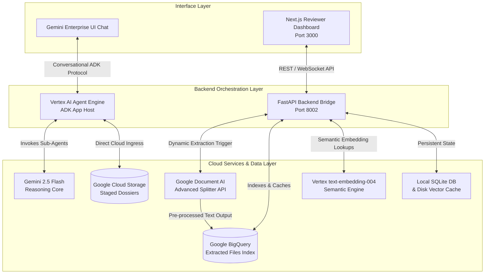
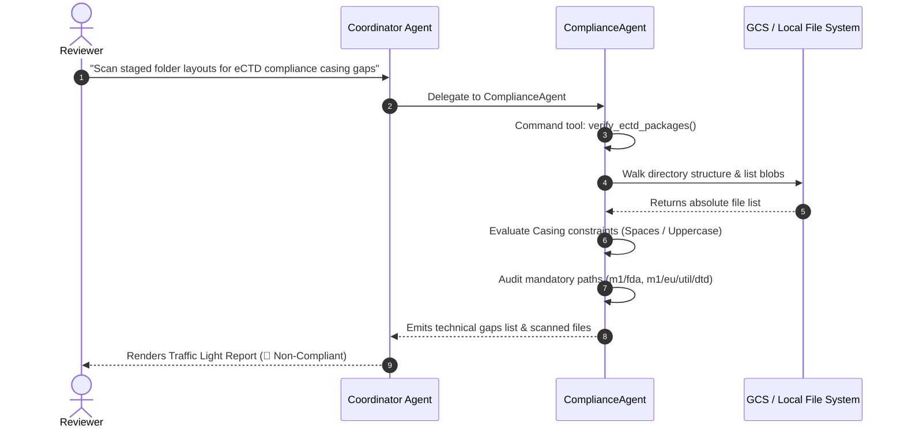

# 🗂️ Executive Slide Deck: Pharma Dossier Harmonizer
**Multi-Agent Regulatory QA Engine for Vertex AI & Gemini Enterprise**

---

## Slide 1: Title Slide

### **Pharma Dossier Harmonizer**
**Accelerating Global Regulatory Submissions with Multi-Agent AI Orchestration**

* **Target Deployment:** Vertex AI Agent Engine & Gemini Enterprise Plus
* **Local Review Environment:** Next.js 14 Power-User QA Dashboard (`localhost:3000`)
* **Core Framework:** Google Agent Development Kit (ADK) & Gemini 2.5 Flash
* **Author / Enterprise Scope:** Global Regulatory Affairs & Data Ingestion Innovation Teams

> [!NOTE]
> **Speaker Notes:**  
> Welcome, leadership and regulatory stakeholders. Today we present the architectural masterclass and business operating model for the **Pharma Dossier Harmonizer**. In an era where pharmaceutical submission timelines directly impact time-to-market and patient access, this multi-agent system provides automated precision audit trails, eCTD structural verification, and deep scientific quality gap assessments.

---

## Slide 2: Executive Summary & Vision

### **Transforming Regulatory Submissions from Reactive to Predictive**

#### **The Vision**
To establish a zero-latency, highly intelligent automated audit engine that acts as a synchronized pair-reviewer for regulatory submission scientists, guaranteeing compliance with **ICH, FDA, and EMA** standards before electronic transport.

#### **Core Value Pillars**
1. **Automated Granular Auditing:** Eliminates manual cross-referencing between dense scientific drafts (Module 3) and official regulatory guidelines.
2. **Multi-Agent Specialization:** Deploys specific, purpose-built ADK agents for chemical facts extraction, labeling checks, file casing validations, and delta diffs.
3. **Dual-Access Architecture:** Seamlessly embedded into standard **Gemini Enterprise Chat** for corporate reviewers while empowering regulatory QA specialists with a dedicated high-fidelity local web application.
4. **Absolute Traceability:** Every identified gap or requirement automatically cites exact source files, section headers, and page numbers.

---

## Slide 3: Business Drivers & Problem Statement

### **The High Cost of Submission Latency and Friction**

#### **Industry Pain Points**
* **Requests for Information (RFIs) & Interlocutory Review (IR):** Regulatory agencies frequently pause review clocks due to missing raw tables or mismatched stability study conditions.
* **Refusal-to-File (RTF) Risks:** Simple administrative errors, such as uppercase file names or missing regional utility folders in electronic Common Technical Document (eCTD) structures, trigger instant gatekeeper rejection.
* **Massive Document Scale:** A typical regional submission spans tens of thousands of pages across disparate formats (scanned PDFs, Word drafts, XML messaging schemas).
* **Guideline Evolution:** Reviewers struggle to continuously map evolving guidelines (e.g., ICH Q1A stability, eCTD v4.0 Controlled Vocabularies) against legacy active product descriptions.

```text
+-------------------------+     +--------------------------+     +--------------------------+
|   Disparate Drafts      |     |  Manual Rule Mapping     |     |  Agency Interception     |
| (PDFs, Docs, XMLs)      | --> | (Weeks of Cross-Checks)  | --> | (Costly RFIs & Delays)   |
+-------------------------+     +--------------------------+     +--------------------------+
```

---

## Slide 4: System Capabilities Overview

### **A Unified Engine Delivering Two Powerful Experiences**

#### **1. Gemini Enterprise Conversational Review**
* **Native Enterprise Chat Integration:** Enterprise users interface natively with the certified multi-agent engine directly from their primary secured workspace client.
* **Multimodal Document Ingress:** Supports seamless direct PDF attachments (leveraging multimodal native vision context) or Cloud Storage URIs (`gs://`) for massive batch parsing.
* **Stateful Multi-Turn Turn Memory:** Seamlessly maintains active dossier context across continuous query refinements.

#### **2. Next.js Interactive QA Dashboard**
* **Real-Time Typewriter Audits:** Live generation of validation status cards rendering scientific potency failures and degradation gaps.
* **Symmetrical Delta Views:** Instant git-style diff views comparing old draft baselines against newly harmonized modules.
* **Interactive Correspondence Threading:** Simulates inbound FDA/EMA communication letters to stress-test response readiness.

---

## Slide 5: High-Level Technical Architecture

### **End-to-End Enterprise Data & Reasoning Bridge**



> [!TIP]
> **Architectural Highlight:**  
> The backend bridge utilizes an ultra-fast caching pattern. Local static files or pre-processed BigQuery indices serve text context instantly to prevent cloud rate-limit deadlocks, seamlessly falling back to advanced on-the-fly Document AI optical processing when new external blobs are introduced.

---

## Slide 6: Deep-Dive: ADK Multi-Agent Orchestrator Engine

### **Specialized Collaborative Reasoning via Google ADK**

The multi-agent reasoning core is orchestrated by a master sequential router (`Coordinator`) delegating specialized operational workloads to individual expert agents.

```text
[PharmaOrchestratorAgent / Coordinator]
  ├── DossierIngestionAgent           --> Tool: extract_dossier_text
  ├── ParallelRegulatoryAnalysisStage
  │     ├── RegulatoryRetrievalAgent  --> Tool: retrieve_regulatory_guidelines
  │     ├── DeltaAnalysisAgent        --> Tool: compare_dossier_versions
  │     └── LabelHarmonizerAgent      --> Tool: search_labels
  ├── ComplianceAgent                 --> Tools: query_excel_criteria, query_guideline_pdf, verify_ectd_packages
  ├── EctdShellAgent                  --> Tool: generate_ectd_shell
  └── FinalReviewerAgent              --> Outputs JSON via HarmonizerResult schema
```

#### **Core Agent Responsibilities**
* **`Coordinator`:** Governs session memory, parses intent, intercepts non-pharmaceutical files, and strictly governs tool routing constraints.
* **`ComplianceAgent`:** Evaluates specific technical criteria, executing local semantic RAG searches on pre-indexed target standards or lookup matching across regional rule matrices.
* **`FinalReviewerAgent`:** Validates all aggregated findings against strict Pydantic schema definitions (`HarmonizerResult`) before emitting corporate audit outputs.

---

## Slide 7: Data Ingestion Pipelines & Document AI Strategy

### **Multi-Path Document Parsing for Massive Scale**

#### **Path A: Chat Window Multimodal Ingress**
* **Execution:** Users drop PDF drafts directly into the Gemini Enterprise interface.
* **Mechanics:** The `DossierIngestionAgent` captures the document bytes and leverages native visual/textual multimodal transformer contexts to parse tables, inline structures, and narratives instantly without remote API calls.

#### **Path B: Serverless BigQuery Data Ingestion**
* **Execution:** Users supply a storage path (`gs://pharma-dossiers-nitinagga-ge/...`) or drop new local files into the QA dashboard.
* **Advanced 15-Page Segment Splitting:** To bypass standard OCR processing buffers and handle multi-hundred-page documents robustly, the backend slices the stream into 15-page sub-batches.
* **Document AI Trigger:** Slices are sent synchronously to a custom Google Cloud Document AI processor (`ID: 53ff9ab7988c6acf`) for structural parsing.
* **Persistence:** Extracted raw text, file state, and generation timestamps are permanently indexed inside BigQuery (`dossier_analysis.extracted_files`) for enterprise-wide retrieval.

---

## Slide 8: Advanced Vector RAG Implementation

### **Zero-Latency Semantic Search over Complex Guidelines**

To accurately evaluate scientific content against complex international standards (e.g., `M4Q_R1_Guideline.pdf`), the system builds a localized persistent Vector RAG memory.

#### **The Mechanics**
1. **Chunking Strategy:** Guidelines are pre-parsed using `PdfReader` and segmented into dense textual chunks using a **700-character size limit with a 150-character sliding window overlap** to preserve context boundaries.
2. **High-Dimensional Vectorization:** Chunks are embedded into 768-dimensional float vectors via Vertex AI **`text-embedding-004`**.
3. **Disk-Caching Architecture:** Vector lists are natively saved into pre-computed cache stores (`.vector_cache/vector_cache_[filename].json`).
4. **High-Speed Execution:** When a sub-agent executes `query_guideline_pdf`, it projects the prompt into vector space and evaluates **cosine similarity in pure local memory (<2ms processing latency)** before piping the top 3 matched text blocks to the LLM.

```text
Raw Guideline PDF --> Chunk Text (700 char / 150 overlap) --> Vertex text-embedding-004 --> Persistent JSON Vector Cache
```

---

## Slide 9: Business Workflow 1: Submission Ingestion & eCTD Structural Audit

### **Validating Physical Submission Packages Against Global Schemas**

#### **The Process Flow**
1. **Ingestion Trigger:** The user issues a prompt requesting an eCTD technical scan over staged workspace directories or GCS buckets (`pharma_agent/user_files/`).
2. **Agent Routing:** Coordinator intercepts the request and dispatches the **`ComplianceAgent`** to execute `verify_ectd_packages`.
3. **Rules Verification Engine:**
   * **Casing Laws Check:** Iterates across all uploaded files to guarantee strictly lowercase naming conventions (flagging spaces or uppercase letters in XML schemas like `COCT_MT150007UV.xsd`).
   * **Structural Path Audit:** Validates the physical layout against mandatory directory paths (guaranteeing the presence of regional folders like `m1/fda` and `m1/eu/util/dtd`).
4. **Output Generation:** Returns an itemized visual status list mapping absolute path omissions alongside fully compliant documents.



---

## Slide 10: Business Workflow 2: Scientific Stability & Potency Gap Analysis

### **Auditing Module 3 Drafts Against Official ICH Quality Standards**

#### **The Process Flow**
1. **Selection Pairing:** The user pairs a draft source dossier (e.g., `m3-dp-pharma-dev - working.md`) with an official standard target (e.g., `M4Q_R1_Guideline.pdf`).
2. **Targeted Extraction:** The reviewer asks to check for accelerated stability testing compliance and forced degradation potency boundaries under Module 3.2.S.
3. **Symmetrical Semantic Alignment:**
   * The agent retrieves the dossier text context from BigQuery or disk.
   * Simultaneously, it invokes semantic RAG caching to extract verbatim validation laws from the target guideline.
4. **Intelligent Interception:** The LLM analyzes both blocks, isolating that while the dossier contains general shelf-life conclusions, **it lacks the tabulated raw results from 6-month accelerated stability testing under stress conditions (40°C / 75% RH)**.
5. **Citation Enforcement:** The emitted response verbatim cites **`M4Q_R1_Guideline.pdf` Page 17 (Section 3.2.S.7.1)** as the source requirement.

---

## Slide 11: Business Workflow 3: Safety Label Harmonization & Prescribing Warnings

### **Aligning Active Compound Descriptions with Prescribing Registries**

#### **The Process Flow**
1. **Contextual Query:** The user requests harmonization of safety warnings for an active substance (e.g., **Adalimumab**) present inside their Module 3 draft files against public registries.
2. **Agent Routing:** The Coordinator delegates to the **`LabelHarmonizerAgent`** to invoke the `search_labels` tool.
3. **Registry Cross-Referencing:** The tool retrieves boxed warning baselines from the simulated DailyMed Structured Product Labeling (SPL) repository.
4. **Semantic Discrepancy Detection:**
   * **Registry Standards Found:** Mandatory prominent boxed warnings for **Serious Infections** (tuberculosis, bacterial sepsis) and **Malignancies** (lymphoma in children/adolescents).
   * **Dossier Audit Result:** Discovers that the draft module completely omits these critical safety declarations.
5. **Actionable Remediation:** Suggests specific prescribing text modifications for Module 1.14 to intercept regulatory refusal actions.

---

## Slide 12: Business Workflow 4: Automated eCTD Module Outlines & Delta Diffs

### **Accelerating Document Structuring and Version Control**

#### **1. Dynamic eCTD Shell Generation**
* **Driver:** Reviewers need to immediately draft submission blueprints for incomplete modules while preserving audit trail findings.
* **Execution:** Invoking the `EctdShellAgent` triggers the generation of standardized hierarchical JSON submission skeletons.
* **Output Integrity:** Automatically maps existing text segments to their valid eCTD taxonomy nodes while explicitly tagging unfulfilled modules (e.g., mapping `3.2.P.1` as "Draft" while marking `3.2.P.8` Stability as **"Data Gap"**).

#### **2. Version Delta Analysis**
* **Driver:** Tracking continuous regulatory revisions across distributed writer teams.
* **Execution:** The `DeltaAnalysisAgent` accepts two discrete file versions and executes local symmetrical diff evaluations (`compare_dossier_versions`).
* **Output Integrity:** Renders Git-style unified line-item insertions and deletions inside the UI, allowing instant visual verification of updated potency figures or resolved formatting gaps.

---

## Slide 13: Target Specification Mismatch Interceptor Workflow

### **Proactive Guardrails Preventing Illogical Document Auditing**

A premium enterprise assistant must proactively guide users away from logical configuration dead-ends rather than generating hallucinatory audits.

#### **The Guardrail Logic**
* **Scenario:** A user selects an active scientific draft dossier (`m3-dp-pharma-dev - working.md`) but mistakenly selects an administrative IT implementation standard (`Validation_eCTD_v4_0_v1_5.pdf`) in the target specification dropdown, asking to validate scientific stability potencies.
* **System Interception:** The LLM evaluation framework detects the semantic domain incompatibility between a chemical text block and a binary folder schema directory.
* **Automated UI Remediation:**
  1. Instantly aborts baseline comparison to prevent garbage emission.
  2. Injects a bold **`⚠️ Target Specification Mismatch`** alert component at the top of the conversation panel.
  3. Clearly explains why technical folder manuals cannot evaluate chemical degradation data.
  4. Scans available files and dynamically appends a **`BEST MATCH` recommendation badge**, directing the user to select **`M4Q_R1_Guideline.pdf`** to complete their scientific audit.

---

## Slide 14: Prompt Library: Core System Directives & Guardrails

### **Unpacking the Coordinator Master System Instructions**

The Coordinator prompt is structurally engineered to enforce flawless multi-agent routing, strict input validation, and clean session memory.

#### **Core System Prompt Rules**
```markdown
### ⚙️ Mandatory Tool-Routing Directives:
1. **Ingesting Dossier Files**: Whenever the user uploads or attaches a PDF file directly in the chat, delegate to the `DossierIngestionAgent`. The agent reads the file natively from the multimodal conversational context. You only invoke the `extract_dossier_text` tool if the user explicitly provides an external `gs://` URI string or staged file path! Strictly FORBIDDEN from falling back to pre-trained default drug templates (like Droncit) for attachments.
2. **eCTD Validation / Package Checks**: Whenever the user asks to check, scan, or validate submission dossier folders or directories layout in GCS, you MUST delegate to `ComplianceAgent` and command it to invoke `verify_ectd_packages`.
3. **Guidelines Auditing vs. Version Comparisons**:
   - If comparing against official regulatory guidelines or static manuals (`M4Q_R1_Guideline.pdf`), delegate to `ComplianceAgent` to use `query_guideline_pdf`. These static manuals are pre-parsed and indexed; query them semantically rather than performing raw text diffs.
   - Only delegate to `DeltaAnalysisAgent` if the user explicitly compares two different drafts of their own dossiers.
```

#### **Keyword Optimization Directive**
To prevent database lookup failures caused by verbose natural language strings, sub-agents are strictly commanded:
> *"When using `query_excel_criteria` or `query_guideline_pdf`, you MUST NOT pass in the entire question string. Parse the request and extract **exactly 1 or 2 singular targeted keywords** (e.g., `"1.1"`, `"DTD"`, `"filename"`) and pass ONLY those values as the query parameter!"*

---

## Slide 15: Prompt Library & Simulated Flow 1: Technical Naming & Folder Audit

### **Simulated Conversation: Physical Folder Schema Audit**

#### **User Prompt**
> *"Please invoke the verify_ectd_packages tool to scan my staged folders in Cloud Storage, list the scanned files, and audit them for compliance casing gaps."*

#### **System Execution Trace**
1. Coordinator parses intent -> Routes to `ComplianceAgent`.
2. `ComplianceAgent` fires tool -> `verify_ectd_packages()`.
3. Bucket scanner evaluates GCS blobs -> Identifies uppercase character sequences and space-delimiters.

#### **Simulated High-Fidelity Output**
```markdown
### 🔴 eCTD Technical Audit Status: Non-Compliant

Your physical folder layout violates eCTD filename casing laws and structural requirements.

**Casing Gaps Identified:**
- Found **33 files** violating naming criteria (casing or spaces detected). Examples:
  * `COCT_MT150007UV.xsd` (Contains uppercase characters)
  * `eCTD 3.2.2 - EU M1 Validation Criteria v8.2.xlsx` (Contains spaces and capitals)
  * `Genericode.zip` (Contains uppercase characters)
  
**Structural Folder Gaps:**
- `🔴 Missing Path:` `m1/fda` (Mandatory US Regional folder)
- `🔴 Missing Path:` `m1/eu/util/dtd` (Mandatory EU DTD Schema folder)

**🟢 Scanned Files List:**
Successfully indexed 46 files in GCS: `m3-dp-pharma-dev - working.md`, `M4Q_R1_Guideline.pdf`, `Validation_eCTD_v4_0_v1_5.pdf`, `eCTD_Specification_v3_2_2_0.pdf`, etc.

### Suggested Next Steps
* *Explain the naming requirements for eCTD schema files under Validation_eCTD_v4_0_v1_5.pdf.*
* *Generate an administrative folder repair runbook.*
```

---

## Slide 16: Prompt Library & Simulated Flow 2: ICH Quality Stability Gap Audit

### **Simulated Conversation: Deep Scientific Quality Audit**

#### **User Prompt**
> *"Validate my staged dossier m3-dp-pharma-dev - working.md against the M4Q_R1_Guideline.pdf specifications. Check if the dossier includes the mandatory accelerated stability potency limits and forced degradation summaries under Module 3.2.S. Cite the exact section and page numbers."*

#### **System Execution Trace**
1. Coordinator routes to `ComplianceAgent`.
2. Semantic RAG engine fires `query_guideline_pdf("accelerated stability potency limits forced degradation Module 3.2.S")`.
3. Resolves top vector chunks from cache -> Evaluates against BigQuery dossier payload.

#### **Simulated High-Fidelity Output**
```markdown
### 🔍 Quality Audit Report: Gaps Identified

An audit of your draft dossier **`m3-dp-pharma-dev - working.md`** against **`M4Q_R1_Guideline.pdf`** has revealed significant scientific gaps in Module 3.2.S:

* **🔴 Stability Potency Gap:**
  * *Requirement:* Under **`M4Q_R1_Guideline.pdf` Page 17 (Section 3.2.S.7.1 - Stability Summary)**, submissions must include tabulated results from accelerated stability testing (at 6 months, 40°C ± 2°C / 75% RH ± 5% RH).
  * *Dossier Status:* Your draft dossier only lists a generic shelf-life summary and lacks the raw tabulated accelerated stability potency metrics.
* **🔴 Potency Degradation Gaps:**
  * *Requirement:* Tabulated potency summary results from Module 3.2.P.8.3 must also be summarized (**Guideline Page 9**).
  * *Dossier Status:* Accelerated degradation study limits are missing.

### Suggested Next Steps
* *Generate an eCTD Module 3.2.S shell and mark these missing sections as Data Gaps.*
* *Retrieve standard forced degradation parameters from ICH Q1A.*
```

---

## Slide 17: Prompt Library & Simulated Flow 3: Safety Label Harmonization Scan

### **Simulated Conversation: Prescribing Safety Warnings Alignment**

#### **User Prompt**
> *"Harmonize the safety warning labels for Adalimumab under my staged dossier Module 3 against the prescribing safety warnings in the DailyMed registry."*

#### **System Execution Trace**
1. Coordinator delegates to `LabelHarmonizerAgent`.
2. Agent executes `search_labels(product_name="Adalimumab")`.
3. Evaluates structured product label facts against active local file profiles.

#### **Simulated High-Fidelity Output**
```markdown
### 🤖 Label Harmonization Summary: Gaps Identified

**Analyzed Substance:** Adalimumab  
**Registry Source:** DailyMed SPL Prescribing Registry

**Registry Boxed Warnings Found:**
1. **⚠️ Serious Infections:** Increased risk of active tuberculosis, invasive fungal infections, and bacterial sepsis.
2. **⚠️ Malignancies:** Increased risk of lymphoma and other pediatric cancers.

**Dossier Alignment Gaps:**
- `✖ Critical Warning Gap:` The staged dossier `m3-device-dmf.md` correctly references active compound properties but **completely omits the mandatory boxed warnings for pediatric malignancies and invasive fungal infections**.

**Suggested Action:**
Update Module 1.14 (Labeling section) to incorporate these boxed safety warnings to ensure FDA compliance.

### Suggested Next Steps
* *Draft a compliant warning label text for Adalimumab serious infections for Module 1.14.*
* *Perform a comparative analysis against alternative active compound files.*
```

---

## Slide 18: Prompt Library & Simulated Flow 4: Dynamic Submission Shell Draft

### **Simulated Conversation: Session Memory & Document Automation**

#### **Context Continuity**
Following the gap audit in Slide 16, the reviewer leverages stateful session memory to execute document automation without re-uploading files.

#### **User Prompt**
> *"Now draft an eCTD shell outline for that drug product module, keeping those identified gaps marked as Data Gaps."*

#### **System Execution Trace**
1. Coordinator references active multi-turn chat session memory -> Identifies target module context.
2. Invokes `EctdShellAgent` -> Command tool: `generate_ectd_shell(module_name="Module 3")`.

#### **Simulated High-Fidelity Output**
```markdown
### 📑 Generated eCTD Submission Skeleton (Module 3)

Compiled standard taxonomy mapping for your active dossier with automatically injected gap placeholders based on previous QA findings:

```json
{
  "eCTD_Module_3": {
    "3.2.P.1": "Description and Composition - Draft Complete",
    "3.2.P.2": "Pharmaceutical Development - Data Gap (Accelerated degradation bounds missing)",
    "3.2.P.3": "Manufacture - Draft Complete",
    "3.2.P.8": "Stability - Data Gap (Missing 6-month raw tabulated potency metrics)",
    "3.2.S.7.1": "Stability Summary - Pending Remediation"
  }
}
```

**Status:** Skeleton staged successfully. Ready for content injection workflows.

### Suggested Next Steps
* *Export this JSON outline directly to Cloud Storage.*
* *Compare this structural outline against the EU M1 Regional validation layout.*
```

---

## Slide 19: Local Sandbox Reviewer Experience (`localhost:3000`)

### **High-Fidelity QA Review Web Application Interface**

The local interface is custom-built for deep analytical reviews, maintaining highly rich aesthetics with curated typography, glassmorphism elements, and live response updates.

```text
+-------------------------------------------------------------------------+
| BioPharma Analytics                                   [Global Search Q] |
+-------------------------------------------------------------------------+
| 📊 Dashboard       |  🟢 ACTIVE KPI SUMMARY                             |
| 📂 Dossiers        |  Total Dossiers: 11 |  Compliant: 50% | Issues: 25%  |
| 🚀 Analysis        |  ------------------------------------------------- |
| 💬 Correspondence  |  [ ⚡ RUN ECTD VALIDATION ]                         |
| ⇄  Delta Analysis  |                                                     |
| 📜 Audit Trail     |  📝 RECENT AUDIT LOGS & TRANSITIONS                 |
| 📚 Reference Lib   |  - Nitin Aggarwal approved Droncit (2h ago)        |
| 🔍 External Res    |  - Gaps found in Numelvi (5h ago)                  |
+---------------------------------------+---------------------------------+
|                                       | 🤖 zero-latency chat            |
|                                       | Agent: Ready to validate.       |
|                                       | [Write prompt here...       ] |
+---------------------------------------+---------------------------------+
```

#### **Core Application Modules**
* **Dashboard (📊):** Features instant physical folder scans (`⚡ Run eCTD Validation`) rendering real-time tree components highlighting folder missing elements.
* **Dossiers (📂):** Lists indexed BigQuery dossiers with drag-and-drop capabilities triggering advanced Document AI extraction routines.
* **Analysis (🚀):** Evaluates custom text sections rendering clean HTML/CSS validation panels dynamically formatted with traffic-light metrics.
* **Delta Analysis (⇄):** Side-by-side layout loading historical baselines alongside current drafts to render unified line-by-line diff blocks instantly.
* **Persistent Chat Panel (🤖):** Docked assistant sidebar with integrated top drop-down file selectors linking local context natively to Vertex AI reasoning models.

---

## Slide 20: Deployment, Scalability & Next Steps

### **Enterprise Infrastructure Provisioning and Rollout**

#### **Provisioning Strategy**
* **Automated Deployment Scripts:** Fully templated GCP rollout scripts (`scripts/deploy_agent_engine.sh`, `setup_gcp.sh`) automate Vertex reasoning engine provisioning, Service Account IAM attachments, and Cloud Run endpoint hosting.
* **Continuous Cloud Synchronization:** Inbound Cloud Functions (`cloud_functions/sync_drive_to_gcs`) provide automated webhook sync bridges, instantly pushing regional submission files from secured user Google Drives into internal staging buckets.

#### **Recommended Next Steps for Reviewer Onboarding**
1. **Sandbox Initialization:** Spin up local APIs via `uvicorn app.main:app --port 8002` followed by `npm run dev` in the frontend package.
2. **Multimodal Verification Test:** Directly attach `125057Orig1s425ltr.pdf` into the Gemini Enterprise workspace chat window to review zero-latency visual table processing capabilities.
3. **Vector RAG Tuning:** Upload localized regional validation rule matrices (e.g., custom internal QA Excel workbooks) into `pharma_agent/ground_truth/` to automatically warm up local disk vector caching tables.
4. **Pilot Execution:** Deploy the complete orchestrator across a live Phase III module review sprint to quantitatively track the elimination of external RFI pauses.

---
**End of Deck Content**
